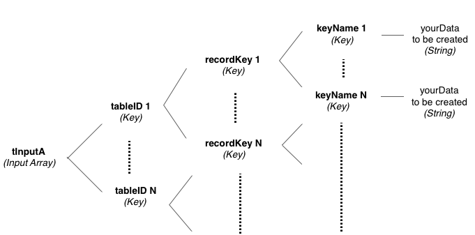
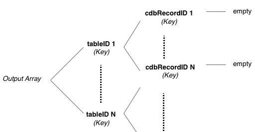

# function cdb_batchCreateLocal(pInputA)
---
## Summary:
This function stores data locally to one or more tables in a single call. A cdbRecordID is returned for every new record created.

## Inputs:
* **`pInputA`** *(Array)* - A multidimensional array of keys, where each key is a table UUID to another array of keys. This table UUID can be obtained by calling the function *cdb_getTableID* and passing in the table name, returns the table's unique UUID. There must be at least one table UUID key in the array.
	* `[tableID 1]` *(Key)* - key that is the first table's UUID, which maps to another array of arbitrary recordKeys, where each recordKey maps to a record. There must be at least one record key in this sub-array.
    	* `[indexKey 1]` *(Key)* - An arbritrary user-defined key for a record. Recommended keys are 1, 2, ..., N, where N is the number of stored records in the table with a UUID of *tableID 1*. This recordKey maps to a sub-array of keyNames that map to the actual data to store in a record. There must be at least one keyname in this sub array. 
    		* `[keyName 1]` *(Key)* - User-defined keyname, where *keyName 1* is an arbitrary key name. Each keyname maps to the actual user data to store. User must provide at least one key per stored value.
    			*  `yourData` *(String)* - the actual data the user wants to store in this keyname in this record in this table.
    		* `*[keyName N]` *(Key)* - The nth user-defined keyname. Repeat *keyName 1*'s sublevel structure.
    	* `*[indexKey N]` *(Key)* - the the nth record key. Repeat *recordKey 1*'s sublevel structure.
    * `*[tableID N]` *(Key)* - key that is the nth table's UUID. Repeat *tableID 1*'s sublevel structure.

> _*optional parameter._


## Outputs:
(Array) -- This output array has similar structure to the input array, except that the indexKeys has the cdbRecordID as a child.  


## API Version:
* `0.3.1` - Introduced

## Examples:
```
local tInputA, tOutputA, tClientsTableID, tOfficeTableID
     
#Table name: clients
#Keys: firstName, lastName, age, income
put cdb_getTableID("clients") into tClientsTableID

#Table name: office
#Keys: name, address
put cdb_getTableID("office") into tOfficeTableID

put "John" into tInputA[tClientsTableID][1]["firstName"]
put "Smith" into tInputA[tClientsTableID][1]["lastName"]
put "47" into tInputA[tClientsTableID][1]["age"]
put "100000" into tInputA[tClientsTableID][1]["income"]

put "Jenny" into tInputA[tClientsTableID][2]["firstName"]
put "Smith" into tInputA[tClientsTableID][2]["lastName"]
put "47" into tInputA[tClientsTableID][2]["age"]
put "100000" into tInputA[tClientsTableID][2]["income"]

put "Smith's Tech" into tInputA[tOfficeTableID][1]["name"]
put "123 office road" into tInputA[tOfficeTableID][1]["address"]

put cdb_batchCreateLocal(tInputA) into tOutputA

#output array: tOutputA[tClientsTableID][1][12345678-abcd-1234-cdef-1234567890ab] #CDBRecordID for John Smith
									    [2][87654321-abcd-1234-cdef-1234567890ab] #CDBRecordID for Jenny Smith
						[tOfficeTableID][1][45678123-abcd-1234-cdef-1234567890ab] #CDBRecordID for Smith's Tech
```