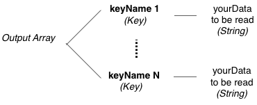

# cdb_readLocal
---
```
function cdb_readLocal(tInputA)
```
## Summary:
This function reads a local record and returns that record’s contents.

## Inputs:
* **`tInputA`** *(Array)* - An array of keys containing data per the following format:
* `["cdbTableName"]` *(String)* - The specified table name.
* `["cdbRecordID"]` *(String)* - A single cdbRecordID.

## Outputs:
(Array) – A record with keys as defined by the schema of the accessed database. 



## API Version:
* `0.3.1` - Introduced

## Examples:
```
local tInputA, tDataA

put fld "recordID" into tInputA["cdbRecordID"]
put "clients" into tInputA["cdbTableName"]

put cdb_readLocal(tInputA) into tDataA
```