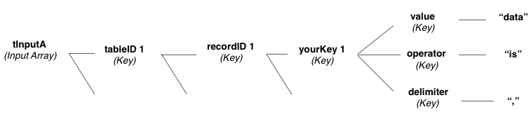

# cdb_batchMergeLocal
---
```
command cdb_batchMergeLocal tInputA
```
## Summary:
This command allows for the modification of a record key's value through comparisons like "is", "is not", "is in", and "is not in". This can be done across multiple keys across multiple records across multiple tables. This occurs locally.

## Inputs:
* **`tInputA`** *(Array)* - An array of one or more keys that are the table IDs of the tables being used in the merge.
    * `[`*`tableID 1`*`]` *(Key)* - The table ID of the first table name that is being worked with.
    	* `[`*`recordID 1`*`]` *(Key)* - The record ID of the first record being modified on this first table.
   			* `[`*`yourKey 1`*`]` *(Key)* - The user defined key in above the record that contains the data to be modified.
   				* `["value"]` *(Key)* - Key that contains the value to compare against *yourKey 1*'s value.
   				* `["operator"]` *(Key)* - Options for this key's value are: "is", "is in", "is not", "is not in". These are operators to compare "value"'s data to *yourKey 1*'s data to perform the merge.
   					* "is" - the data in the "value" key will overwrite the data in the record's *yourKey* key.
   					* "is in" - Checks the data in *yourKey* seperated by the delimiter to make sure that the data in "value" is somewhere in the data in *yourKey*, otherwise it will append it with the delimiter.
   					* "is not" - makes sure the data in *yourKey* *is not* the data in "value", otherwise it will put empty into the key. 
   					* "is not in" - Checks the data in *yourKey* seperated by the delimiter to make sure that the data in "value" is not anywhere in the data in *yourKey*, otherwise it removes it with the delimiter.
				* `["delimiter"]` *(Key)* - Reccomendations are "," or a line feed. The delimiter seperates the data in *yourKey*.
   			* `[`*`yourKey N`*`]` *(Key)* - Repeat *yourKey 1's* sublevel structure.
		* `[`*`recordID N`*`]` *(Key)* - Repeat *recordID 1*'s sublevel structure.
	* `[`*`tableID N`*`]` *(Key)* - Repeat *table ID 1*'s sublevel structure.



## API Version:
* `0.3.1` - Introduced

## Examples:
```
local tInputA, tRecordID, tTableID

put fld "recordID data" into tRecordID
put cdb_getTableID("clients") into tTableID

put "Mark" into tInputA[tTableID][tRecordID]["firstName"]["value"]
put "is not in" into tInputA[tTableID][tRecordID]["firstName"]["operator"]
put "," into tInputA[tTableID][tRecordID]["firstName"]["delimiter"]

put "Talluto" into tInputA[tTableID][tRecordID]["lastName"]["value"]
put "is" into tInputA[tTableID][tRecordID]["lastName"]["operator"]
put "," into tInputA[tTableID][tRecordID]["lastName"]["delimiter"]

cdb_batchMergeLocal tInputA
```
