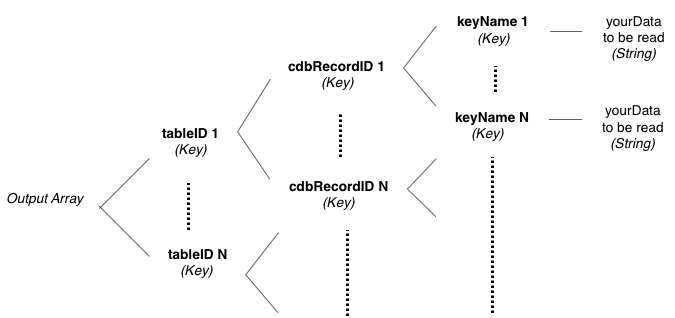

# cdb_batchReadCloud
---
```
function cdb_batchReadCloud(pInputA)
```
## Summary:
This function reads a list of records on the cloud and returns those records' contents. It takes the input array and essentially fills the empty contents of each cdbRecordID key.

## Inputs:
* **`pInputA`** *(Array)* - A multidimensional array of keys, where each key is a table UUID that maps to another array of keys. This table UUID can be obtained by calling the function *cdb_getTableID* and passing in the table name, returning the table's unique UUID. There must be at least one table UID key in the array.
    * `[`*`tableID 1`*`]` *(Key)* - key to the first table's UUID, which maps to an array of keys, where each key is a cdb record UUID. There must be at least one record UID key in this sub-array.
    	* `[`*`cdbRecordID 1`*`]` *(Key)* - key that is the record UUID for the first record wanting to be read. Must put empty or any arbirary value in it.
    	* `*[`*`cdbRecordID N`*`]` *(Key)* - key that is the record UUID for the nth record wanting to be read. Must put empty or any arbirary value in it.
    * `*[`*`tableID N`*`]` *(Key)* - key that is the nth table's UUID. Repeat *tableID1*'s sublevel structure.

> _*optional parameter._

![BatchRead input diagram] (../chartimages/deleteReadInput.png)
## Outputs:
(Aray) -- This output array is essentially the same as the input array but with the contents of the cdbRecordID keys filling with the appropriate information for that record. The cdbRecordID keys maps to an array of keys that are the keyNames for that record. Each keyName maps to the stored data that corresponds to that keyname.

## Additional Requirements:
This API call requires internet access.
## API Version:
* `0.3.1` - Introduced

## Examples:
```
local tInputA, tTableID, tDataA
     
put cdb_getTableID("clients") into tTableID
     
repeat for each line xRecordID in fld "recordID"
	put empty into tInputA[tTableID][xRecordID]
end repeat
     
put cdb_batchReadCloud(tInputA) into tDataA
```
