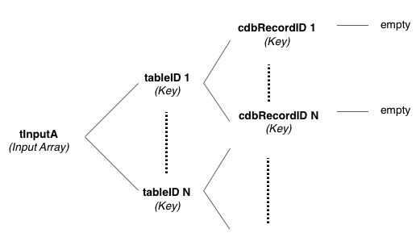

# command cdb_batchDeleteLocal tInputA
---
## Summary:
This function deletes a list of local records.

## Inputs:
* **`pInputA`** *(Array)* - A multidimensional array of keys, where each key is a table UID that maps to another array of keys. This table UID can be obtained by calling the function *cdb_getTableID* and passing in the table name, returning the table's unique UID. There must be at least one table UID key in the array.
    * `[tableID 1]` *(Key)* - key that is the first table's UID, which maps to an array of keys, where each key is a cdb record UID. There must be at least one record UID key in this sub-array.
    	* `[cdbRecordID 1]` *(Key)* - key that is the record UID for the first record wanting to be deleted. Must put empty or any arbirary value in it.
    	* `*[cdbRecordID N]` *(Key)* - key that is the record UID for the nth record wanting to be deleted. Must put empty or any arbirary value in it.
    * `*[tableID N]` *(Key)* - key that is the nth table's UID. Repeat *tableID1*'s sublevel structure.

> _*optional parameter._

> Note: To delete all the records for a given table, use "\*" as key mapping to empty in place of the array of cdbRecordID keys.


## API Version:
* `0.3.1` - Introduced

## Examples:
```
local tInputA, tOutputA, tClientsTableID, tOfficeTableID
     
#Table name: clients											   #Table name: office				
#RecordIDs: 
#12345678-abcd-1234-cdef-1234567890ab	   					       #45678123-abcd-1234-cdef-1234567890ab
 87654321-abcd-1234-cdef-1234567890ab

put cdb_getTableID("clients") into tClientsTableID                                       
put cdb_getTableID("office") into tOfficeTableID
     
put empty into tInputA[tClientsTableID]["*"]
put empty into tInputA[tOfficeTableID]["45678123-abcd-1234-cdef-1234567890ab"]
     
cdb_batchDeleteLocal tInputA

#Now both tables have no records inside
```