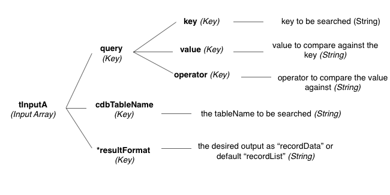

# cdb_QueryCloud
---
```
function cdb_QueryCloud(tQueryA)
```
## Summary:
This function searches the specified table over the cloud, and returns the subset that matches that query in several possible formats.

## Inputs:
* **`tInputA`**  *(Array)* - An array of keys containing the query, the table name, and an optional output format.
	* `["query"]` *(Array)* - An array formatted as follows:
    	* `["key"]` *(String)* - One of the following:
    		- *`yourKey`* - Searches the specified key
    		- `"$"` - Searches all schema-defined keys
    		- `"*"` - Searches all schema-defined keys and internal keys.
    	* `["value"]` *(String)* - The value to compare against each record's value at the key specified above.
    	* `["operator"]` *(String)* - The [comparison operator](QueryOperators.md) to compare each record's value at the key specified above to the value specified above.
    - `["cdbTableName"]` *(String)* - The table name or table ID to search through.
    - `*["resultFormat"]` *(String)*: 
    	-  `"recordList"` *(default)* - returns a line-delimited list of the recordIDs that match the query.
    	- `"recordData"` - returns an array of full records that match the query.



> _*optional parameter._

## Outputs:
* *(String)* - If *pInputA["resultFormat"]* is "recordList" or if no such key is provided:
	* Output is  a line-delimited list of the recordIDs that match the query.
* *(Array)* - If *pInputA["resultFormat"]* is "recordData":
	* Output is an array where each key is a recordID that matches the query, with subkeys defined by the schema.

## Additional Requirements:
This API call requires internet access.

## API Version:
* `0.3.1` - Introduced

## Examples:
```
local tQueryA, tInputA

put "transactionAmount" into tQueryA["key"]
put "25.00" into tQueryA["value"]
put ">" into tQueryA["operator"]
put tQueryA into tInputA["query"]
put "transactions" into tInputA["cdbTableName"]
get cdb_QueryCloud(tInputA) 
-- list all cdbRecordIDs with 'transactionAmounts' greater than 25.00
```

```
local tQueryA, tInputA

put "firstName" into tQueryA["key"]
put "Kevin" into tQueryA["value"]
put "=" into tQueryA["operator"]
put tQueryA into tInputA["query"]
put "users" into tInputA["cdbTableName"]
put "recordData" into tInputA["resultFormat"]
get cdb_QueryCloud(tInputA) 
-- array of all records with firstName 'Kevin' located in the "users" table
```