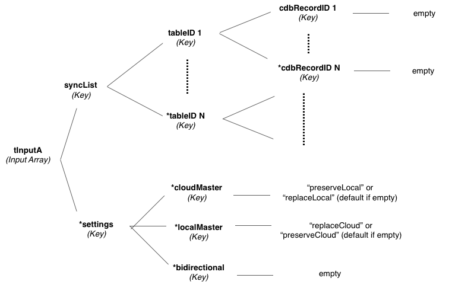

# cdb_syncList
---
```
command cdb_syncList tInputA
```
## Summary:
This command sync's any amount of specified records from any number of tables in the cloud to local direction, the local to cloud direction, or bi-directional.

## Inputs:
* **`tInputA`** *(Array)* - An array of one or two keys that specify what records and tables to sync and how to sync them.
	* `[`*`tableID 1`*`]` *(Key)* - An array of one or more records IDs in this table to sync.
  		* `[`*`cdbRecordID 1`*`]` *(Key)* - key that is the cdbRecordID for the first record wanting to be read. Must put empty or any arbirary value in it.
  		* `*[`*`cdbRecordID N`*`]` *(Key)* - key that is the cdbRecordID for the nth record wanting to be read. Must put empty or any arbirary value in it.
 	* `*[`*`tableID N`*`]` *(Key)* - An array of one or more records IDs in this table to sync.
 	
	* `*["settings"]` *(Key)* - An array of keys that can be set to produce different output forms.
    	- `*["cloudMaster"]` *(Key)* *(default)* - Sync's records from cloud down to local. Default case if no master is specified.
    		- `"preserveLocal"` *(String)* - Local records that do not exist in the cloud are preserved. However, if a local record and cloud record have the same cdbRecordID but different contents, then the cloud record overwrites the local record since cloud is master.
    		- `"replaceLocal"` *(String)* *(default)* - Does not preserve any local records that are not on the cloud. (Brute force brings cloud down to local). Default case if "cloudMaster" key is empty.
    	- `*["localMaster"]` *(Key)* - Sync's records from local up to the cloud.
    		- `"preserveCloud"` *(String)* *(default)* - Cloud records that do not exist in locally are preserved. However, if a local record and cloud record have the same cdbRecordID but different contents, then the local record overwrites the cloud record since local is master.
    		- `"replaceCloud"` *(String)* - Does not preserve any cloud records that are not local. (Brute force pushes local up to cloud). Default case if "localMaster" key is empty. Note: user caution, as this will destroy all cloud data in the specified table and overwrite it with your local data.
    	- `*["bidirectional"]` *(Key)* - Sync's records in both local to cloud and cloud to local direction. Hence, local gets cloud's unique records, and cloud gets local's unique records. If a local record and cloud record have the same cdbRecordID but different contents, then the record that was last modified takes precedence.
    		- `empty` - put empty into this key if it is being used.

> _*optional parameter._
> 
> Note: choose local master OR cloud master, but not both.

> _1) If local or cloud master are NOT specified, then "cloudMaster" : "replaceLocal" is default._
> 
> _2) If "cloudMaster" is specified but is empty, then "cloudMaster" : "replaceLocal" is default._
> 
> _3) If "localMaster" is specified but is empty, then "localMaster" : "preserveCloud" is default._

## Additional Requirements:
This API call requires internet access.
	
## API Version:
* `0.3.1` - Introduced

## Examples:
```
local tTableID, tInputA

--gets the table ID
put cdb_getTableID("customers") into tTableID

--builds the tableID/recordID array structure
--fld "recordID List" is a line delimited list of cdbRecordIDs to be synced
repeat for each line xRecordID in fld "recordID List"
	put empty into tInputA["syncList"][tTableID][xRecordID]
end repeat
     
put "replaceLocal" into tInputA["settings"]["cloudMaster"]
     
cdb_syncList tInputA
```