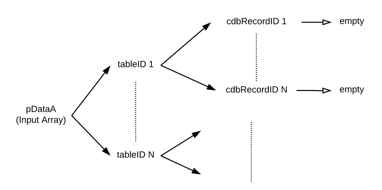

# command cdb_batchDelete pDataA,pTarget
---
## Summary
This function deletes a set of records.

## Inputs
* **pDataA** *(Array)* - A multidimensional array, where each key is a tableID that maps to another array where the keys are recordIDs, and the elements are empty. There must be at least one tableID key in the array.
    * [tableID 1] *(Array)* - The first table's ID, maps to subarray of record IDs.
    	* [cdbRecordID 1] - Key that is the recordID for the first record to be deleted, or "*" to delete all records in a table. 
    		* empty - The value of the corresponding key must be empty.
    	* \*[cdbRecordID N] - Key that is the record ID for the nth record to be deleted.
    		* empty - The value of the corresponding key must be empty.
    * \*[tableID N] *(Array)* - Key that is the nth table's ID. Repeat *tableID1*'s sublevel structure.

* **pTarget** *(String)* - The place to delete record(s), either "cloud" or "local".

> _*optional parameter._

> Note: To delete all the records for a given table, use "\*" as key mapping to empty in place of the array of cdbRecordID keys.



## Additional Requirements
This API call requires internet access for "cloud".

## Examples
```
local tDataA, tTarget, tClientsTableID, tOfficeTableID
     
# Table name: clients				   		
# RecordIDs: 
# 12345678-abcd-1234-cdef-1234567890ab	   
# 87654321-abcd-1234-cdef-1234567890ab
     
# Table name: office
# cdbRecordIDs:
# 45678123-abcd-1234-cdef-1234567890ab

put cdb_getTableID("clients") into tClientsTableID                                       
put cdb_getTableID("office") into tOfficeTableID

put empty into tDataA[tClientsTableID]["*"]
put empty into tDataA[tOfficeTableID]["45678123-abcd-1234-cdef-1234567890ab"]
     
put "cloud" into tTarget

cdb_batchDelete tDataA,tTarget

# Now both tables have no records
```