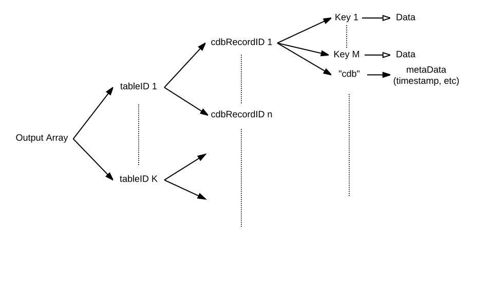

# function cdb_batchRead(pInputA)
---
## Summary
This function reads a list of records and returns those records' contents. It takes the input array and fills the empty contents of each cdbRecordID key.

## Inputs
* **pInputA** *(Array)* - A multidimensional array, where each key is a tableID that maps to another array where the keys are recordIDs, and the elements are empty. There must be at least one tableID key in the array.
    * ["cdbTarget"] *(String)* - place to read records, either "cloud" or "local"
    * [tableID 1] *(Key)* - Key is the first table's ID, maps to subarray of record IDs.
    	* [cdbRecordID 1] *(Key)* - Key that is the record ID for the first record to be read, or "*" to read all records in a table. 
    		* empty - There must be an empty element child to each record ID
    	* *[cdbRecordID N] *(Key)* - key that is the record ID for the nth record wanting to be read. 
    		* empty - There must be an empty element child to each record ID
    * *[tableID N] *(Key)* - key that is the nth table's ID. Repeat *tableID1*'s sublevel structure.

> _*optional parameter._

> Note: To read all the records for a given table, use "\*" as key mapping to empty in place of the array of cdbRecordID keys.

![BatchRead input diagram] (images/BatchReadInput.svg)
## Outputs
(Aray) -- This output array is essentially the same as the input array, but with the contents of the cdbRecordID keys filling with the appropriate information for that record. The cdbRecordID keys maps to an array of keys that are the keyNames for that record. Each keyName maps to the stored data that corresponds to that keyname.



## Additional Requirements
This API call requires internet access.

## API Version
* 0.3.0 - Introduced

## Examples
```
local tInputA, tOutputA, tClientsTableID, tOfficeTableID

#Table name: clients											   #Table name: office				
#RecordIDs: 
#12345678-abcd-1234-cdef-1234567890ab	   					   #45678123-abcd-1234-cdef-1234567890ab
 87654321-abcd-1234-cdef-1234567890ab

put cdb_getTableID("clients") into tClientsTableID                                       
put cdb_getTableID("office") into tOfficeTableID
     
put empty into tInputA[tClientsTableID]["*"]
put empty into tInputA[tOfficeTableID]["45678123-abcd-1234-cdef-1234567890ab"]

put "cloud" into tInputA["cdbTarget"]
     
put cdb_batchRead(tInputA) into tOutputA

#output array: tOutputA[tClientsTableID]["12345678-abcd-1234-cdef-1234567890ab"]["firstName"] - "John"
																				["lastName"] - "smith"
                                        ["87654321-abcd-1234-cdef-1234567890ab"]["firstName"] - "Jenny"
                                        										["lastName"] - "Smith"
                        [tOfficeTableID]["45678123-abcd-1234-cdef-1234567890ab"]["name"] - "Smith's Tech"
                       														 ["address"] - "123 office road"
                                                                             
```
