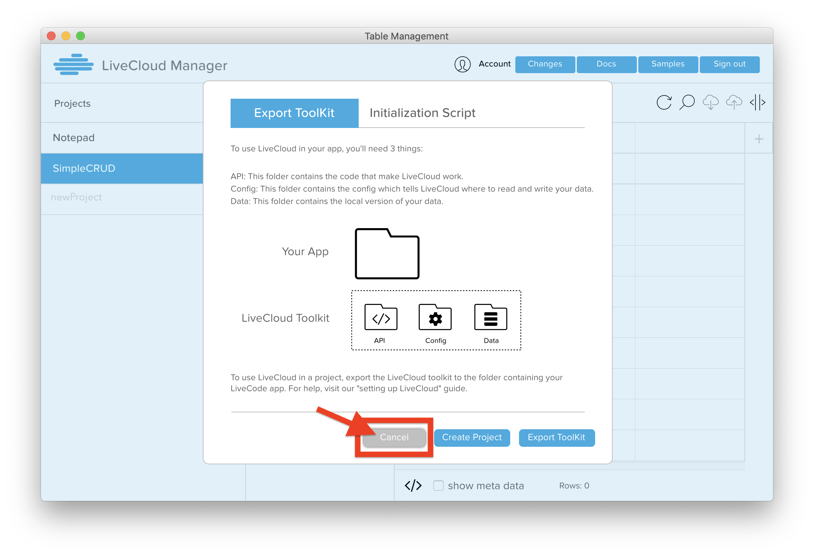
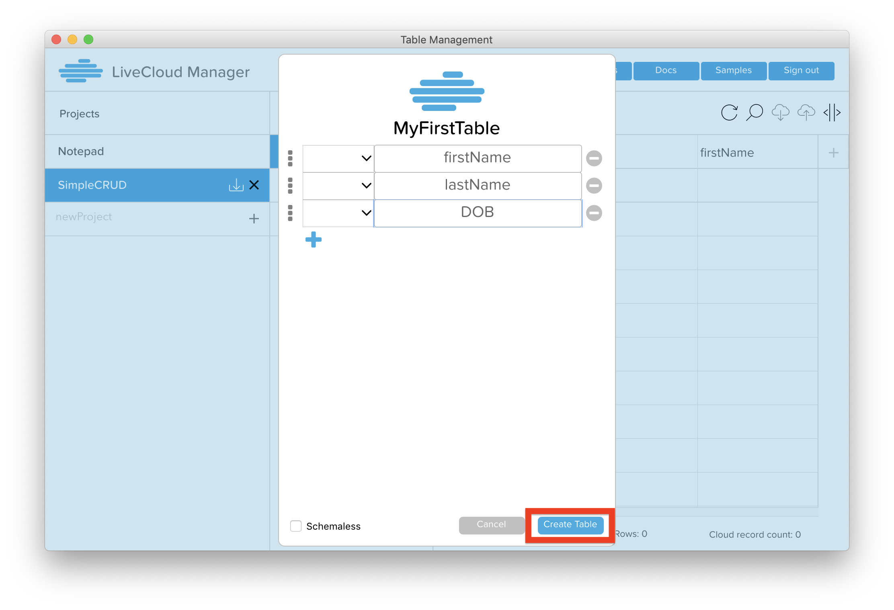
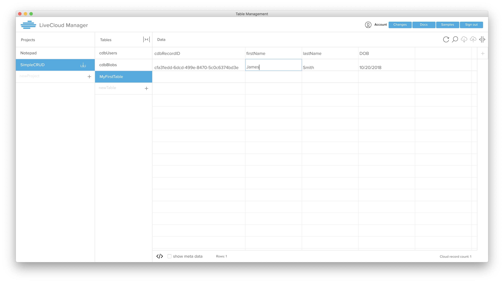
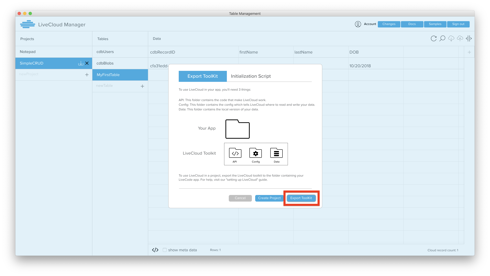
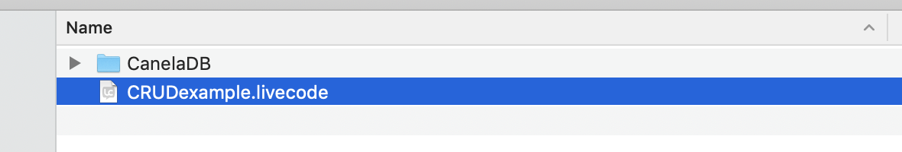
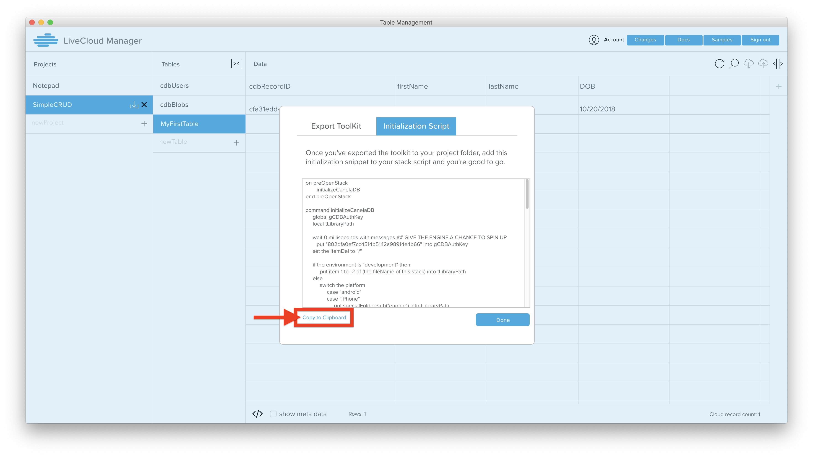
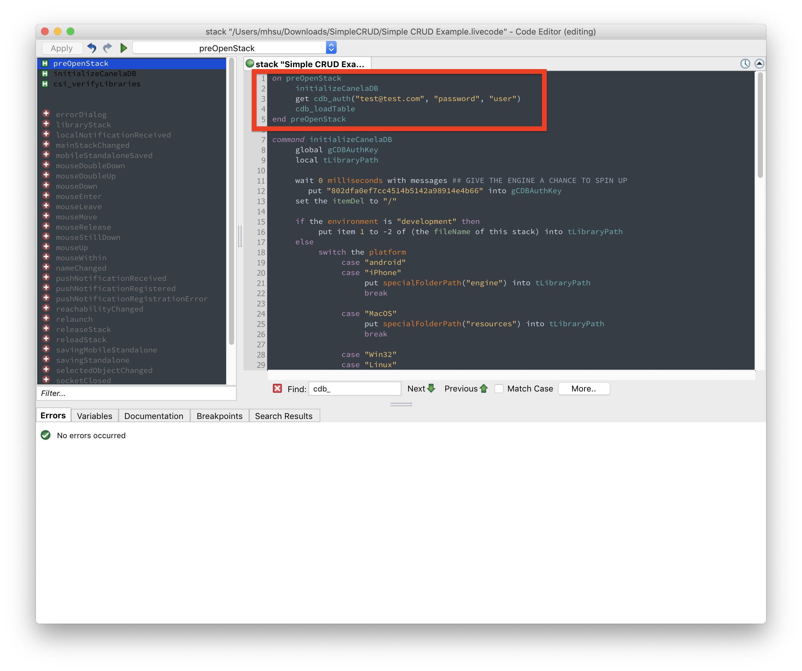
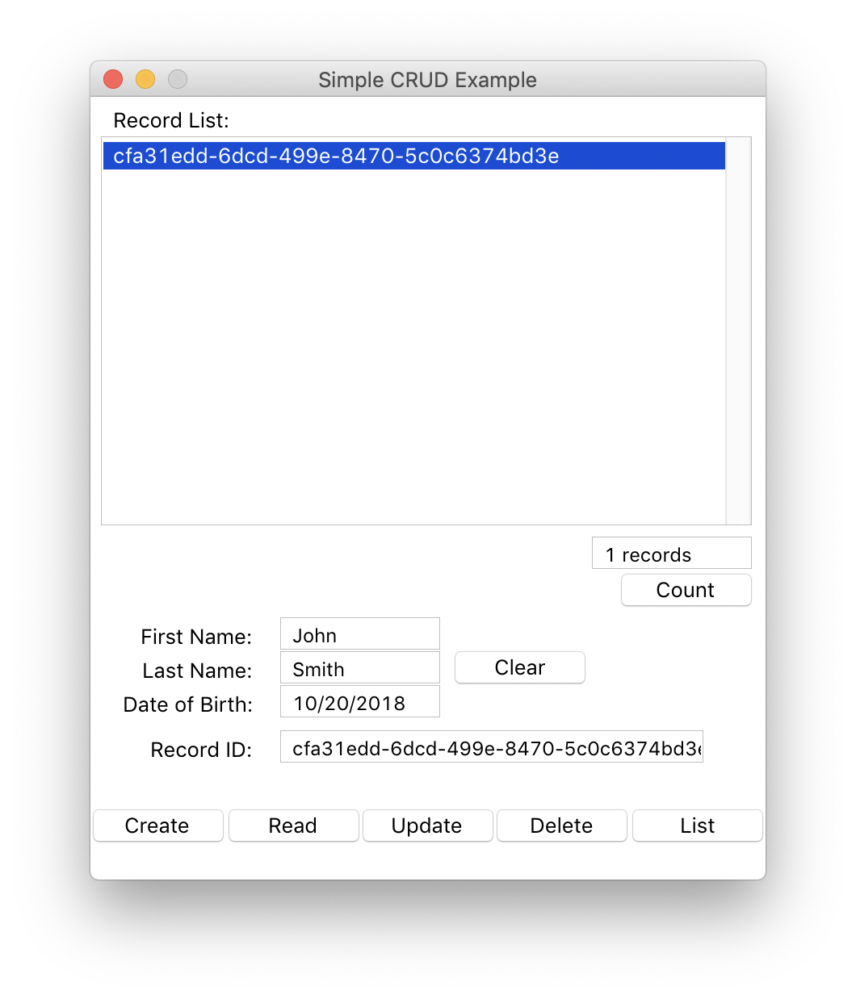
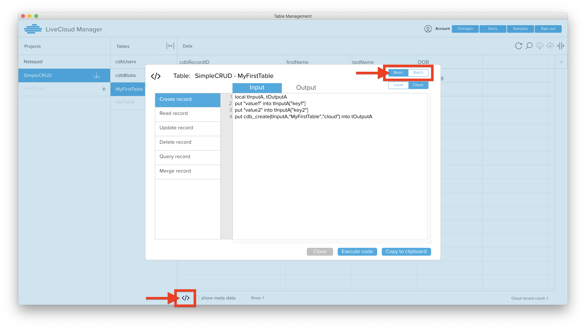

## CRUD Instructions

1. Log in to LiveCloud Manager (LCM). You should see a list of projects.
2. Create a new project, named "SimpleCRUD". You will see the "Export Toolkit" modal pop-up. Click "Cancel". (We don't want to export the project yet). 
3. Create a new table, named "MyFirstTable". Give it keys "firstName","lastName", and "DOB". 
4. Click on the auto-generated "cdbUsers" table in the SimpleCRUD project. Double click in the Data section, underneath where it says "CDBRecordID". A modal will pop-up, showing you options to create a new user. 
5. Use the dialog to create a new user with email "test@test.com" and password "password". Make sure you click the "Auto Verify" checkbox -- this will allow the user to log in and auth without first having to verify their email. You need to create a new user in order to access cloud data; otherwise your app will not be able to link to the cloud. You can see more information about user auth here: [User Authorization](AddingUsers.md)
6. Click on the "MyFirstTable" table. Double click under the "firstName" column and type in a name. This will create a new record in the cloud. Then type in a lastName and DOB under those respective columns.
7. Download the example stack here: [Example Crud Stack](https://livecloud.io/examples/CRUDexample.livecode). Save the sample stack in a folder named "simpleCRUD". (You don't have to name the folder "simpleCRUD", but it's easier to reference for the purposes of this tutorial.)
8. In LCM, click on the "export/download" icon next to the "SimpleCRUD" project name. Click the "Export Toolkit" button in the pop-up, and choose the "simpleCRUD" folder where you saved the sample stack. It will create a "CanelaDB" folder next to your example stack. 
9. Copy the "Initialization Script" from LCM. This script will load all the libraries needed for CanelaDB, and also deals with security and configuration. Open the sample stack, and paste this in the stack script of the sample stack. 
10. Inside the preOpenStack handler, after the "initializeCanelaDB" call, add the following lines:
```livecodeserver
get cdb_auth("test@test.com","password","user")
cdb_loadTable
```
This will allow your app to auth and connect to the cloud. Your user credentials MUST MATCH the user you created in step 5. Your stack script should look like this when you are done:

11. Quit LiveCode, and then re-open the Simple CRUD example stack. You should see the the record you created in the "MyFirstTable" in LCM appear in the Record list. If you click on the record, you can see its contents appear in the fields below. You can then click every button and look at the script of each button, as well as the "recordList" field, to see what cdb_calls are used to do everything.

12. For instance, let's start with the "Create" button. As you can see below, what we do to __create__ a cloud record is that we:
     <ul>
     <li>Build an array with keys that match the keys of our table</li>
     <li>Specify the table in which we want to create the record: "MyFirstTable"</li>
     <li>Specify that we want the table to be created on the cloud, as opposed to on our local computer.</li>
     <li>The output of `cdb_create()` is a recordID, which we put into the field "cdbRecordID data". RecordIDs are used to refer to specific records, similar to an SQL primary key.</li>
     <li>Once we've finished creating the record, we send a mouseUp to our "List" button, so our screen will refresh the list with the new record.</li>
<li> The button script:
```livecodeserver
on mouseUp
     local tArrayA, tRecordID
     
     --GATHER DATA FOR CLOUD
     put fld "firstName data" into tArrayA["firstName"]
     put fld "lastName data" into tArrayA["lastName"]
     put fld "dob data" into tArrayA["DOB"]
     
     put cdb_create(tArrayA,"MyFirstTable","cloud") into fld "cdbRecordID data"
     if not cdb_result() then
          answer "Oops" with "OK"
     end if
     
     dispatch "mouseUp" to btn "clear"
     send "mouseUp" to btn "List" in 10 ticks
end mouseUp
```
</li>
</ul>
13. If you look at the code inside the "Read" button, or inside the "recordList" button, you will see code for __reading__ a specified record. 
     <div>
     <p>Here, we specify the table to read from, the recordID to read, and "cloud" to tell CanelaDB that we want to read a record from the cloud.</p>
     <p>Then, we are returned an array where the key to the array is the recordID. (We do this in case you have done a `cdb_read()` passing multiple recordIDs to read). So, to get access to the record's data, we look inside `tRecordA[tRecordID][###THE NAME OF THE KEY WE WANT HERE####]`. In our example, we loop through ALL the keys of the record, and if there is a field that matches, we put the data into the field.</p>
```livecodeserver
on mouseUp
     local tRecordA, tRecordID
     
     put fld "cdbRecordID data" into tRecordID
     
     put cdb_read("MyFirstTable",tRecordID,"cloud") into tRecordA
     if not cdb_result() then
          answer "Oops" with "OK"
          exit mouseUP
     end if
     
     --POPULATE THE FIELDS WITH CLOUD DATA
     repeat for each key xKey in tRecordA[tRecordID]
          if there is a fld (xKey && "data") then put tRecordA[tRecordID][xKey] into fld (xKey && "data")
     end repeat
     put tRecordID into fld "cdbRecordID data"
end mouseUp
```
</div>
14. You can look inside the rest of the buttons to find examples of many simple things you might want to do using CanelaDB.<div></div>
15. You can also look inside of LCM, by clicking the Code Snippet icon (looks like `</>`) at the bottom of LCM. This provides some boilerplate code for CRUD operations, as well as Query. You can switch from "Batch" to "Basic" to see the simplest ways to use the CanelaDB APIs. 
