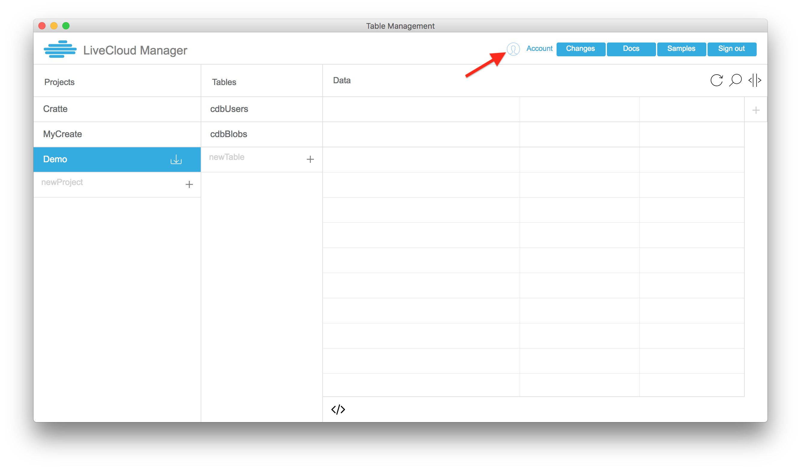
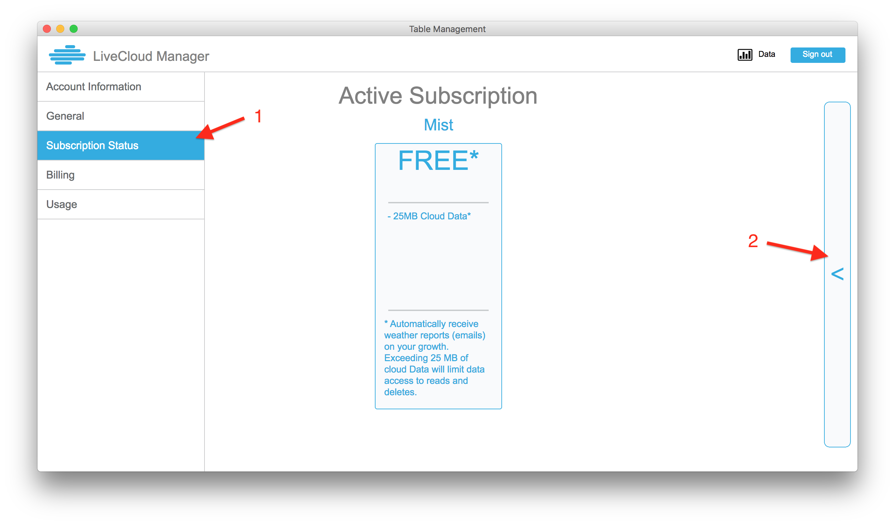
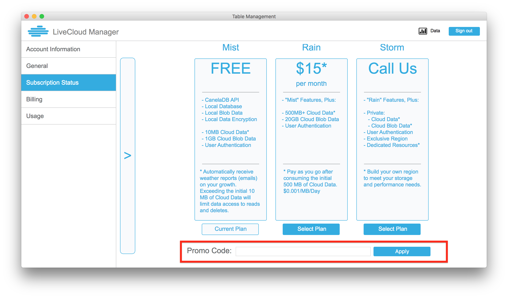
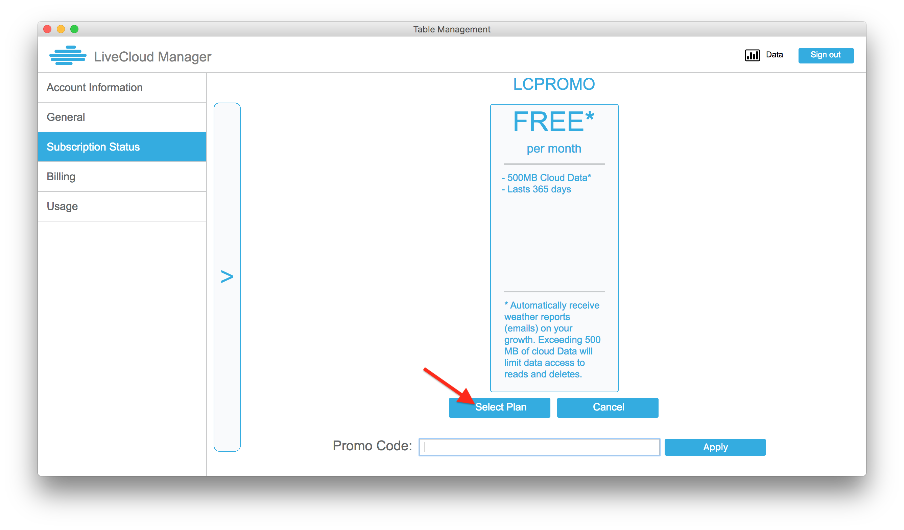
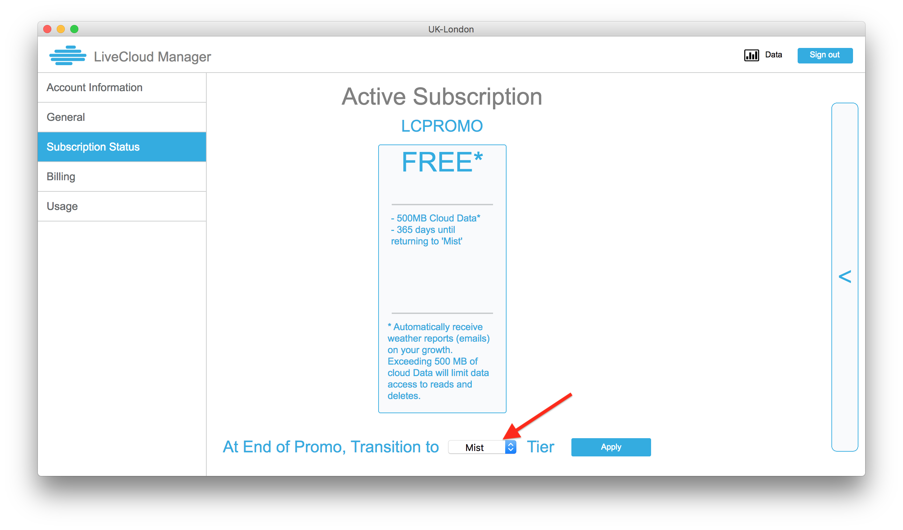

## Adding a Promo Code to your account

If you have already created an account, but you want to add a Promo Code, you can do that. Just follow the instructions below:

1. Open the LiveCloud Manager, and log in to your account.
2. Click on the "Account" button in the top header.

3. In the account page, click on "Subscription Status" in the left sidebar.
4. Click on the large "<" button on the right side of the screen.

5. This will show all the possible subscription plans. At the bottom of the screen, type in your Promo Code.

6. If your Promo Code is valid, you will see a new plan pop up. Click on "Select Plan" to select this plan. 

7. You are now subscribed to the new plan! You will see your new plan listed as the "Active Subscription". If you want, you can also set your plan to automatically transition to a free (default) or paid tier after the Promo expires.
