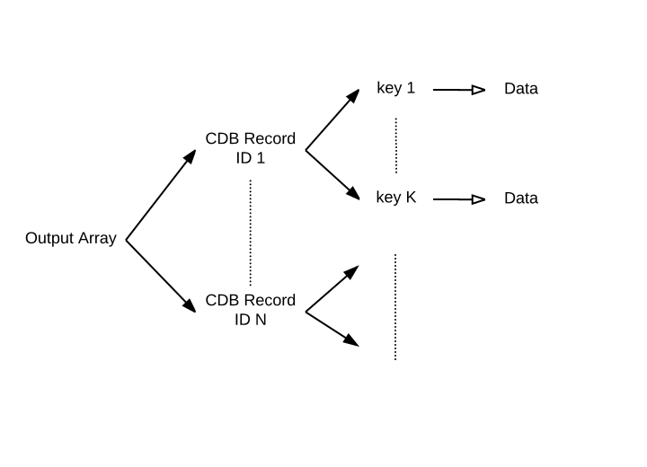

# function cdb_Query(pKey,pOperator,pValue,pTable,pTarget,pResultFormat)
---
## Summary
This function searches the specified table, and returns the subset that matches the query in several possible formats.

## Inputs
* **pKey**  *(String)* - The key in the table to query on.

* **pOperator**  *(String)* - The [comparison operator](./QueryOperators.md) used when comparing values in the table against the input value.

* **pValue**  *(String)* - The value to compare with.

* **pTable** *(String)* - The name or tableID of the specified table.

* \***pTarget** *(String)* - The place to query for the record, either "cloud" or "local".

* **pResultFormat** *(String)*:

	* "recordList" *(default)* - returns a line-delimited list of the recordIDs that match the query.
    * "recordData" - returns an array of full records that match the query.

> _*optional parameter._


## Outputs
* *(String)* - If *pResultFormat* is "recordList" or if no such key is provided:
	* Output is  a line-delimited list of the recordIDs that match the query.
* *(Array)* - If *pResultFormat* is "recordData":
	* Output is an array where each key is a recordID of a record in the specified table that matches the query, with subkeys defined by the schema.


## Additional Requirements
This API call requires internet access.

## Examples
```
local tKey, tOperator, tValue, tTable, tTarget, tResultFormat, tOutputA

# Table name: clients
# Keys: firstName, lastName, age, income

put "firstName" into tKey
put "=" into tOperator
put "Jenny" into tValue
put "clients" into tTable
put "cloud" into tTarget

# recordData output format
put "recordData" into tResultFormat
# OR
# recordList output format
put "recordList" tResultFormat


put cdb_Query(tKey,tOperator,tValue,tTable,tTarget,tResultFormat) into tOutputA

# recordData Output: 
# tOutputA["87654321-abcd-1234-cdef-1234567890ab"]["cdb"] - metadata
                                                  ["firstName"] - "Jenny"
                                                  ["lastName"] - "Smith"
                                                  ["age"] - 46
                                                  ["income"] - 100000
						  
# recordList Output: 
# 87654321-abcd-1234-cdef-1234567890ab
```