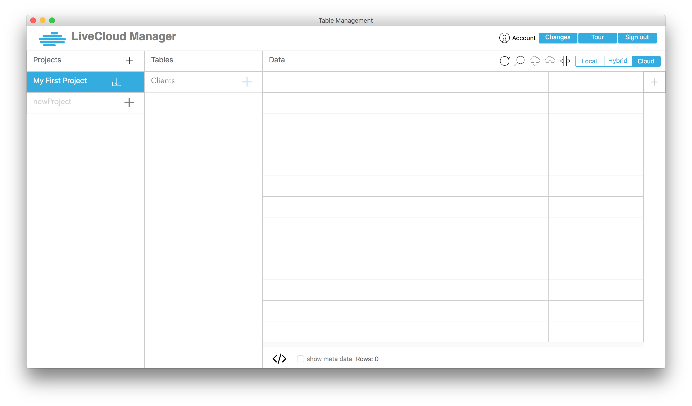
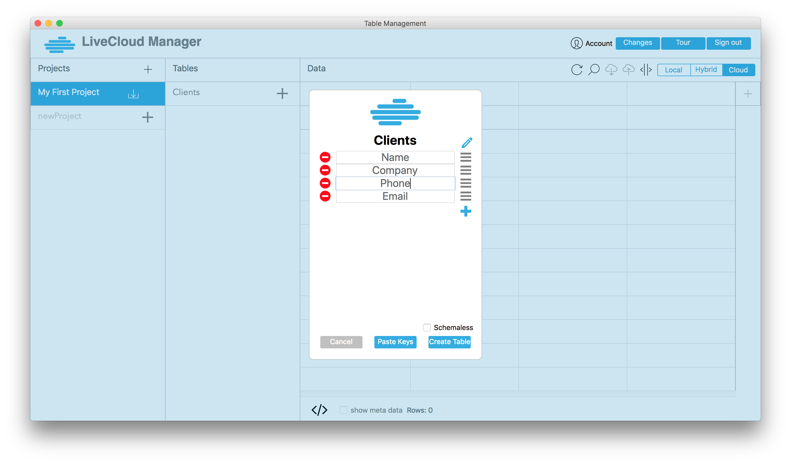
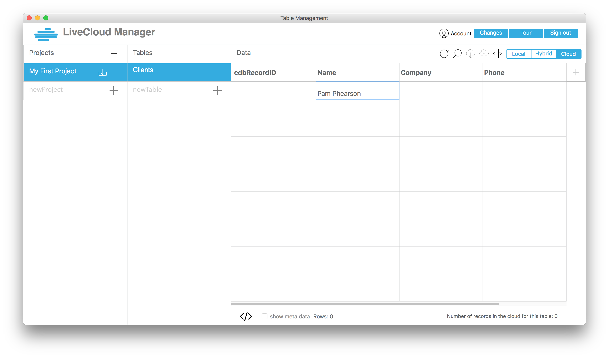
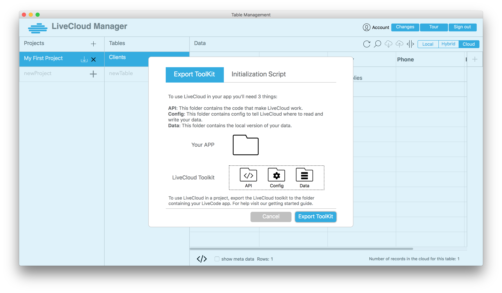
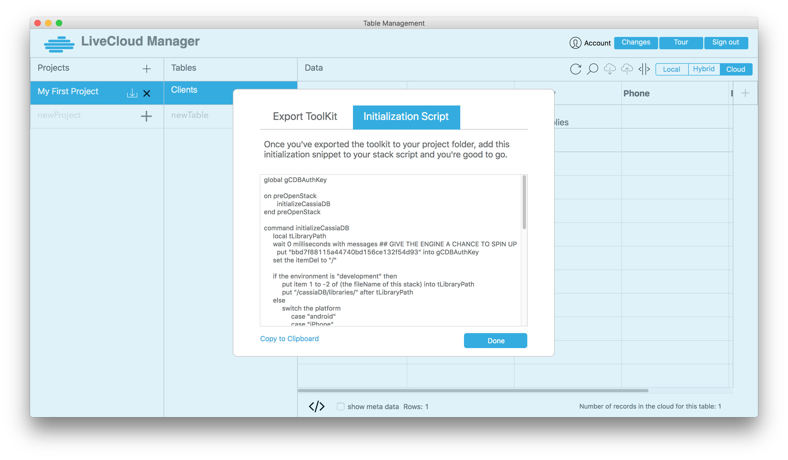

## Setting Up LiveCloud and CanelaDB.

1. [Download the LiveCloud Manager application](https://livecloud.io/get-started).
2. Create an account (or login if you've already created an account previously).
3. Use LiveCloud Manager (LCM) to create a new project.

4. Use LiveCloud Manager (LCM) to create new tables in your project. 

5. Define the keys for your table when prompted.

6. You can now add records to your cloud

7. Export the CanelaDB toolkit from the LiveCloud Manager by clicking the "Download" icon next to your project name.

8. Create a new LiveCode stack, and copy the starter code from LiveCloud Manager.

9. Restart Livecode and open up your new stack -- CanelaDB's API is now available.