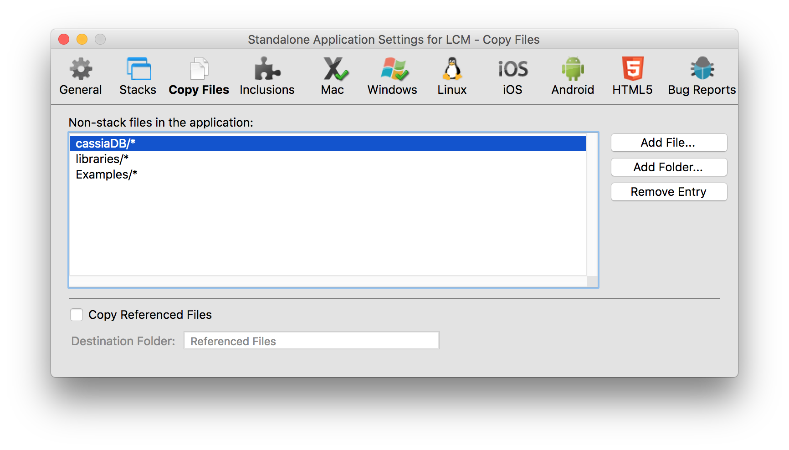

In order to build a standalone for an application using the LiveCloud SDK, you will need to change some of your standalone settings.

## Copy Files - CanelaDB Libraries
You should include the entire CanelaDB folder in the "Copy Files" portion. When you build the standalone, it will include the libraries, your configuration, and also the local database. Be sure to include only the local files that you want to be pre-loaded for your users. For most internet-enabled applications, we recommend deleting the database folder completely. This will allow CanelaDB to download and create its local database on the fly.

## Inclusions
The following inclusions are used by CanelaDB and need to be selected in your standalone settings (we recommend selecting these manually):

- Internet
- SSL & Encryption
- mergJSON
- tsNet